# Raport z eksperymentów Starlink HTSim

## 1. Co analizuje ten raport

Raport zbiera wyniki benchmarków uruchamianych przez `build/run_benchmarks.sh`. Każdy benchmark zapisuje konfigurację eksperymentu, próbki tras, widoczność satelitów oraz — dla uruchomień bez `--routing-only` — binarne logi htsim parsowane później przez `getstat.sh`.

Analizowane pliki na pojedynczy benchmark:

```text
<case>.config.json        # parametry symulacji
<case>.routes.csv         # RTT, route_found, hash trasy, hop count, Dijkstra CPU
<case>.visibility.csv     # liczba aktywnych uplinków i dystans do najbliższego satelity
<case>.summary.csv        # proste wpisy key,value z programu
<case>.binlog             # binarny log htsim, jeśli symulacja nie była routing-only
<case>.queue_ascii.txt    # log kolejek po parsowaniu przez getstat.sh
<case>.queue.csv          # surowe zdarzenia kolejek w CSV
```

## 2. Struktura repozytorium

```text
starlink-htsim/
  README.md
  build/
    Makefile
    build.sh
    run_benchmarks.sh
    getstat.sh
    starlink_exp
    results/
  src/
    Makefile
    libhtsim.a
    parse_output.cpp
    parse_output
    eventlist.cpp/.h
    logfile.cpp/.h
    loggers.cpp/.h
    route.cpp/.h
    ping.cpp/.h
    xcp*.cpp/.h
    starlink/
      main.cpp
      constellation.cpp/.h
      city.cpp/.h
      satellite.cpp/.h
      node.cpp/.h
      isl.cpp/.h
      binary_heap.cpp/.h
      experiment_logger.cpp/.h
```


Najważniejsze miejsca:

- `build/` — katalog, z którego uruchamiasz kompilację i benchmarki; tutaj powstaje binarka `starlink_exp` oraz katalog `results/`.
- `src/` — rdzeń symulatora htsim, implementacja event loopa, logowania, kolejek, protokołów i parsera `parse_output`.
- `src/starlink/` — kod eksperymentu satelitarnego: generowanie konstelacji, miasta, uplinki, ISL-e, routing i logger eksperymentalny.

## 3. Jak działa symulacja

Symulacja jest dyskretno-zdarzeniowa. `EventList` przechowuje zdarzenia w czasie symulowanym, a `starlink_exp` okresowo aktualizuje pozycje endpointów i satelitów, aktywne uplinki oraz trasę między źródłem i celem.

`Constellation` tworzy satelity na podstawie liczby płaszczyzn orbitalnych i liczby satelitów w płaszczyźnie. W trybie `--sat-selection adjacent` można uruchomić małą liczbę sąsiednich satelitów z pełnej orbity 66-slotowej, co jest przydatne do sanity testów, np. konfiguracji z dwoma satelitami. W trybie `spread` satelity są rozłożone regularnie po dostępnych slotach.

`City` reprezentuje naziemny endpoint. Dla danego czasu oblicza współrzędne punktu na obracającej się Ziemi, sprawdza dystans do satelitów i aktywuje uplinki tylko do satelitów w zasięgu. Zasięg wynika z geometrii LEO i limitu dystansu używanego w kodzie.

Routing działa przez Dijkstrę po grafie złożonym z endpointów, aktywnych uplinków/downlinków oraz ISL-i. W `--routing-only` program tylko przelicza trasy i loguje metryki routingu. Bez `--routing-only` uruchamiany jest ruch pingowy, a standardowe loggery htsim zapisują też zdarzenia kolejek do binloga.

## 4. Benchmarki

Benchmarki są pogrupowane według prefiksu nazwy:

- `A_*` — minimalny sanity test, w tym konfiguracja `1 plane × 2 adjacent satellites`.
- `B_*` — mała skala, wzrost liczby satelitów i płaszczyzn.
- `C_*` — benchmark podobny do artykułu: New York → Seattle dla 6/12/24 płaszczyzn.
- `D_*` — London → New York z ruchem ping i logami kolejek.
- `E_*` — wrażliwość na przepustowość ISL przy stałej topologii.

## 5. Definicje metryk

- `availability_pct` — procent próbek, w których `route_found == 1` dla kierunku `out`.
- `mean_rtt_ms`, `p95_rtt_ms` — RTT liczone tylko dla próbek, w których trasa istnieje.
- `route_changes_per_min` — liczba zmian trasy na minutę; obejmuje także przejścia do `NO_ROUTE`.
- `mean_route_segment_duration_s` — średni czas trwania spójnego segmentu tej samej znalezionej trasy.
- `mean_isl_hops` — średnia liczba hopów przez inter-satellite links.
- `mean_dijkstra_cpu_ms` — średni koszt CPU pojedynczego wyszukiwania trasy.
- `max_queue_bytes` — największe zajęcie kolejki zaobserwowane w `queue_ascii.txt`; dostępne tylko dla benchmarków z ruchem pakietowym.

## 6. Wykresy

### Dostępność tras we wszystkich benchmarkach

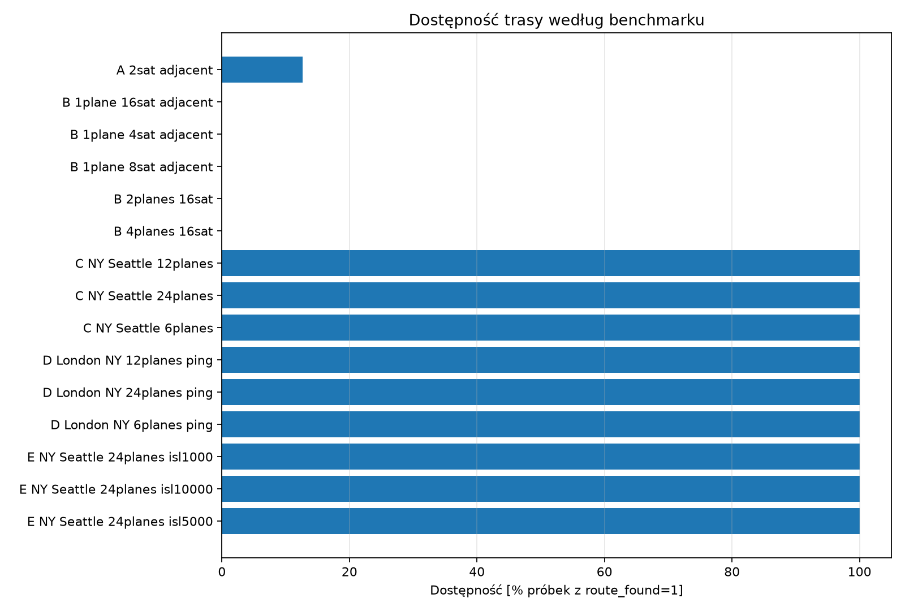

Odsetek próbek, w których Dijkstra znalazł trasę między endpointami.

### Średni RTT we wszystkich benchmarkach

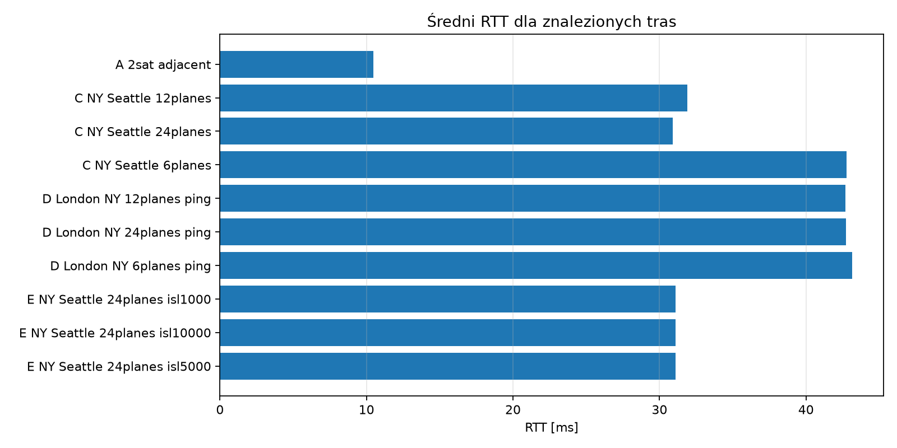

Średni RTT liczony tylko dla próbek, w których trasa istniała.

### Częstotliwość zmian tras

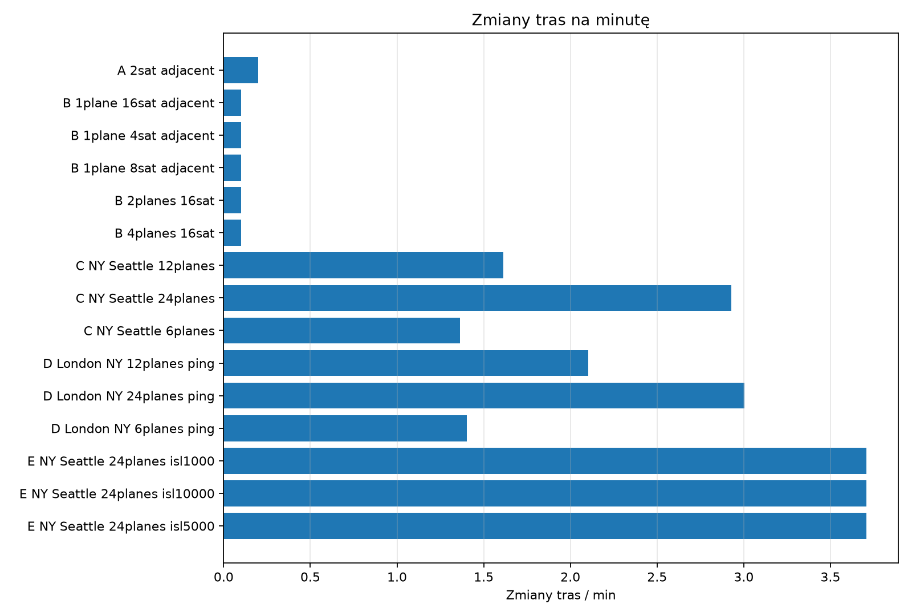

Częstotliwość zmian identyfikatora trasy lub przejść do stanu NO_ROUTE.

### Koszt obliczania tras

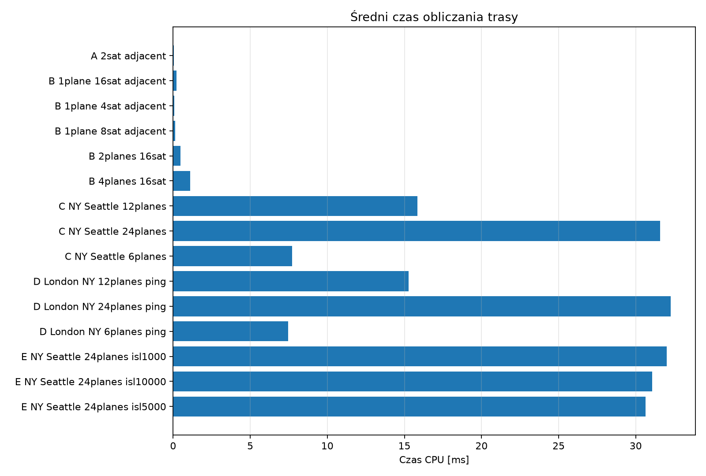

Czas CPU mierzony przy wyszukiwaniu tras. Przy małych topologiach powinien być bardzo niski.

### Średnia liczba hopów ISL

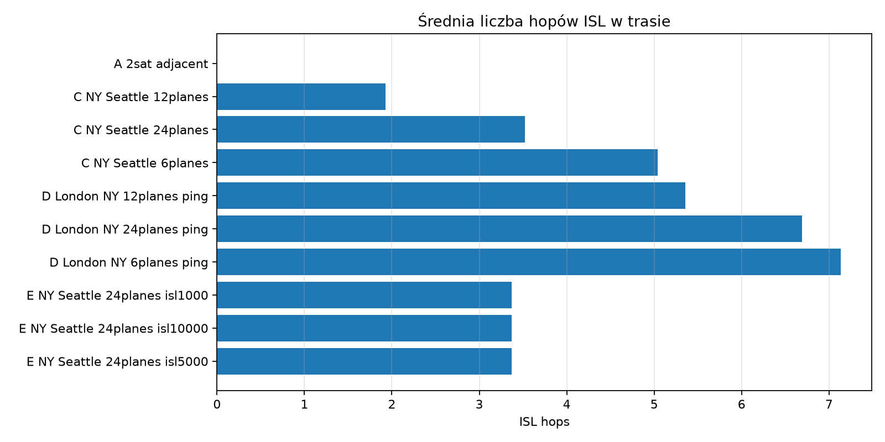

Pokazuje, czy trasy korzystają głównie z jednego satelity, czy z sieci inter-satellite links.

### RTT w czasie: NY-Seattle

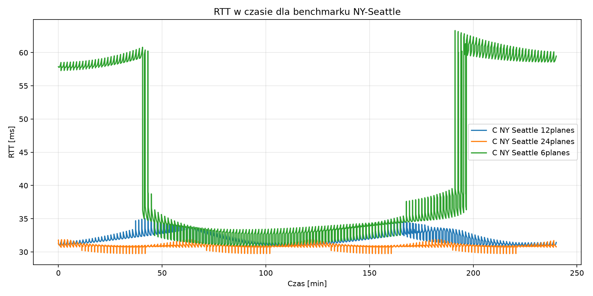

Porównanie konfiguracji 6/12/24 płaszczyzn orbitalnych.

### Rozkład RTT: NY-Seattle

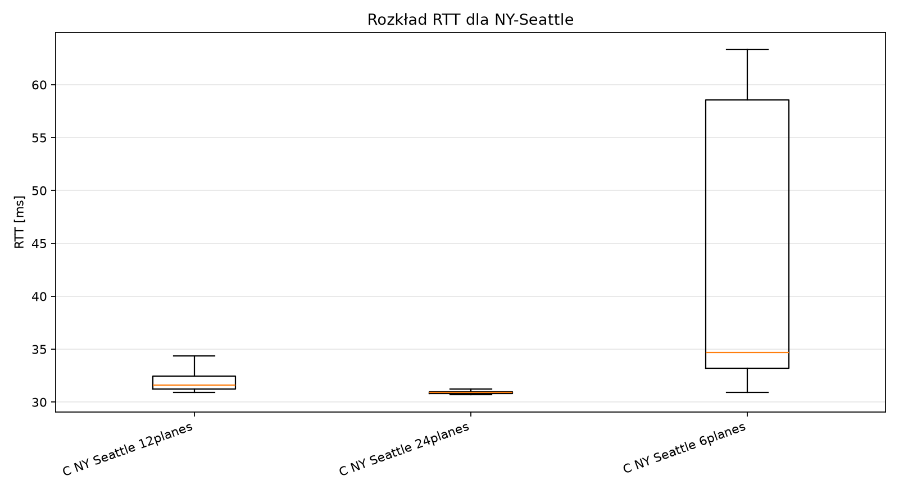

Boxplot bez outlierów, liczony dla próbek z istniejącą trasą.

### RTT w czasie: London-New York

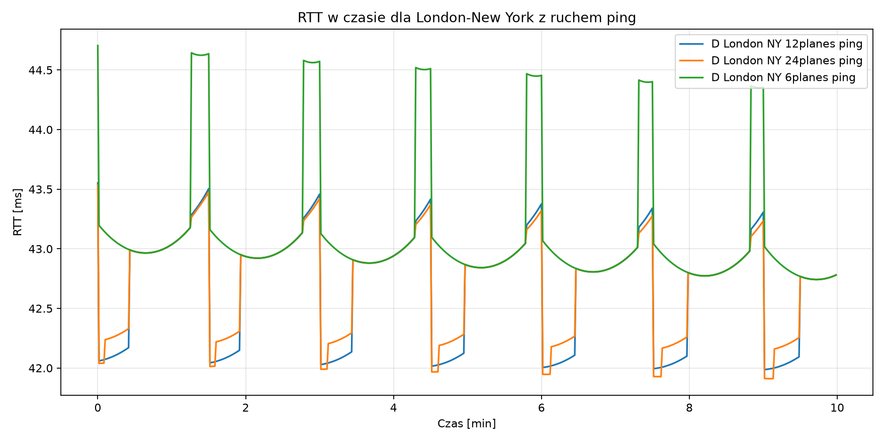

Benchmark z włączonym ruchem pakietowym i binlogiem kolejek.

### Wrażliwość na przepustowość ISL

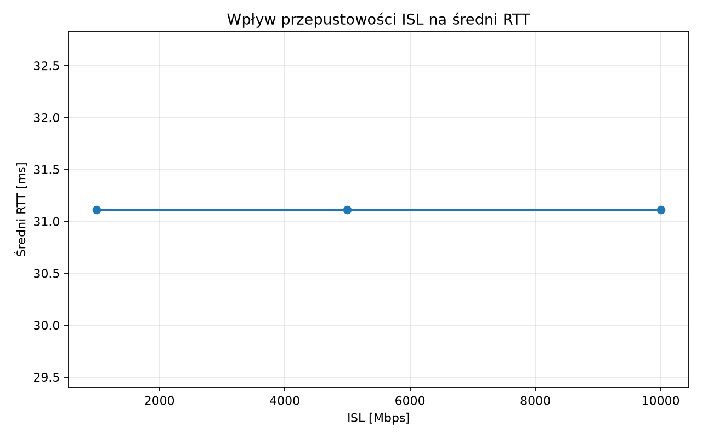

Porównanie średniego RTT dla różnych wartości --isl-mbps.

### Maksymalne zajęcie kolejek

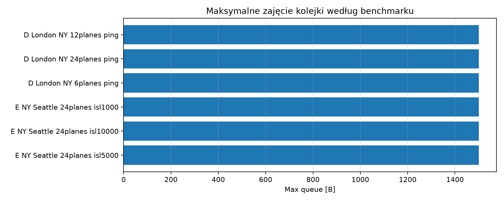

Metryka wyciągnięta z plików queue_ascii.txt produkowanych przez getstat.sh.

### Zajęcie kolejki w czasie

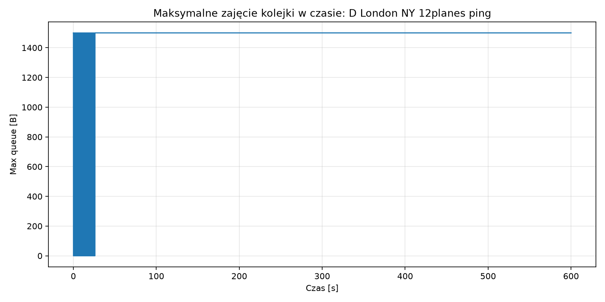

Pierwszy dostępny benchmark z kolejkami: D_London_NY_12planes_ping.

### Widoczność satelitów w sanity teście

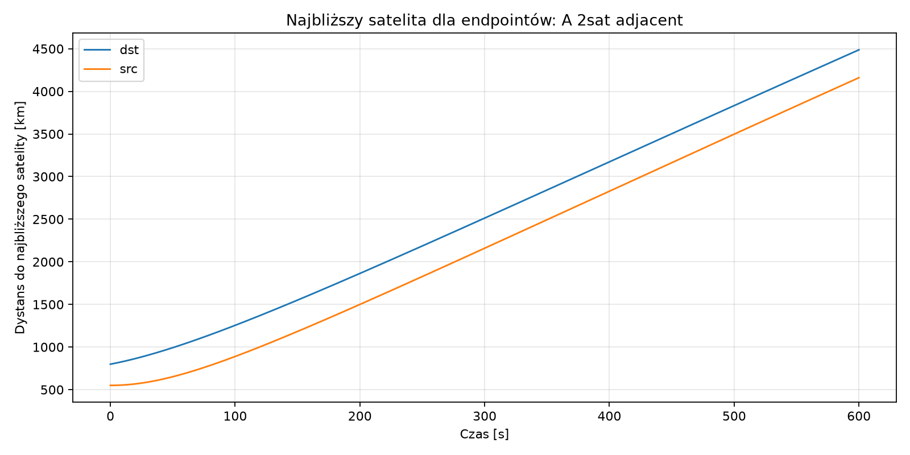

Dystans endpointów do najbliższego satelity w konfiguracji 2-satelitarnej.

## 7. Ograniczenia interpretacji

- Benchmark z dwoma satelitami jest sanity testem kodu, a nie realistycznym modelem pokrycia Starlink.
- W obecnej wersji benchmarki C/D/E używają ISL-i, ale nie implementują jeszcze gęstej siatki naziemnych relayów z artykułu.
- Dla `routing-only` nie ma throughputu, strat ani kolejek, bo nie jest generowany ruch pakietowy.
- RTT w tabelach jest liczone tylko dla momentów, w których istnieje trasa; dostępność należy interpretować razem z RTT.
- Częste zmiany tras oznaczają, że trasa o niskiej latencji może być mniej stabilna operacyjnie.