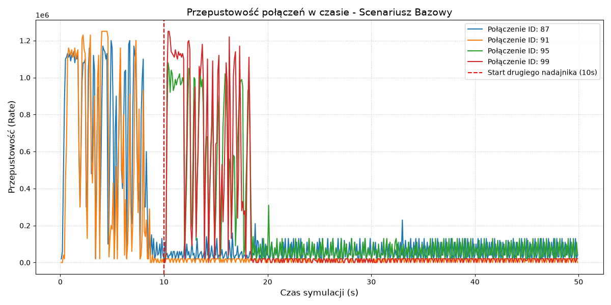

# Raport z analizy wydajności i protokołów routingu w konstelacjach satelitarnych LEO (Starlink HTSim)

*Autorzy: Iga Antonik, Mateusz Król, Łukasz Wilański*

## Streszczenie

Niniejszy dokument przedstawia wyniki badań nad wydajnością symulowanych sieci satelitarnych na niskiej orbicie okołoziemskiej (LEO), inspirowanych architekturą konstelacji Starlink. Wykorzystując środowisko symulacyjne oparte na zmodyfikowanym rdzeniu `htsim`, przeprowadzono serię zautomatyzowanych testów referencyjnych (benchmarków). Badania miały na celu ewaluację dostępności tras, opóźnień (RTT), obciążenia buforów satelitarnych oraz wpływu dynamiki orbitalnej na zachowanie warstwy sieciowej i transportowej.

## 1. Środowisko Symulacyjne i Architektura

Projekt opiera się na dyskretno-zdarzeniowym symulatorze sieciowym, rozbudowanym o moduł fizyki orbitalnej i geometrii sferycznej. Zrezygnowano z prekompilowanych makr statycznych na rzecz zunifikowanego narzędzia binarnego `starlink_exp`, które pozwala na pełną parametryzację środowiska bezpośrednio z poziomu interfejsu wiersza poleceń (CLI).

Symulator działa w oparciu o następujące komponenty główne:

* **Constellation:** Moduł odpowiedzialny za generowanie układu satelitów na podstawie zadanej liczby płaszczyzn orbitalnych oraz zagęszczenia węzłów w poszczególnych płaszczyznach. Obsługuje zarówno tryb `spread` (równomierne rozmieszczenie), jak i `adjacent` (symulacja sąsiadujących węzłów do celów testowych).
* **City:** Węzeł naziemny (endpoint) przeliczający swoje współrzędne w funkcji czasu na obracającej się Ziemi. Odpowiada za aktywację łączności bezprzewodowej (Uplink/Downlink) wyłącznie do satelitów znajdujących się w zasięgu geometrycznym.
* **Algorytm Dijkstry:** Moduł dynamicznego wyznaczania najkrótszych ścieżek grafowych przez łącza międzysatelitarne (ISL), aktualizujący trasy w zdefiniowanych interwałach (np. co 1000 ms).

Proces badawczy został zautomatyzowany poprzez potok skryptowy (`run_benchmarks.sh`), który po zakończeniu symulacji wykorzystuje parser `parse_output.cpp` do ekstrakcji i agregacji danych z binarnych logów zdarzeniowych do ustrukturyzowanych plików CSV.

## 2. Metodologia i Scenariusze Badawcze (Benchmarks)

W celu zbadania zachowania sieci zdefiniowano pięć klas scenariuszy badawczych:

* **A (`sanity`)**: Test minimalnej konfiguracji (1 płaszczyzna, 2 satelity w trybie `adjacent`), służący do walidacji podstawowej fizyki modelu.

* **B (`small scale`)**: Skalowalne scenariusze testowe z rosnącą liczbą satelitów i płaszczyzn.

* **C (`partial deployment`)**: Symulacja połączenia Nowy Jork $\rightarrow$ Seattle dla konstelacji częściowych (6, 12, 24 płaszczyzn orbitalnych), badająca wpływ gęstości pokrycia na jakość usługi (QoS).

* **D (`ping & queue`)**: Połączenie Londyn $\rightarrow$ Nowy Jork z aktywnym ruchem sieciowym, generujące logi zapotrzebowania buforów (queue_ascii).

* **E (`ISL sensitivity`)**: Analiza wrażliwości opóźnień na zmiany bazowej przepustowości łączy międzysatelitarnych (ISL).

Poddano analizie szereg metryk, w tym: 
- `availability_pct` — procentowy wskaźnik poprawnie odnalezionych tras (procent próbek, w których `route_found == 1` dla kierunku `out`).
- `mean_rtt_ms`, `p95_rtt_ms` — RTT liczone tylko dla próbek, w których trasa istnieje.
- `route_changes_per_min` — liczba zmian trasy na minutę; obejmuje także przejścia do `NO_ROUTE`.
- `mean_route_segment_duration_s` — średni czas trwania spójnego segmentu tej samej znalezionej trasy.
- `mean_isl_hops` — średnia liczba hopów przez inter-satellite links.
- `mean_dijkstra_cpu_ms` — średni koszt CPU pojedynczego wyszukiwania trasy.
- `max_queue_bytes` — największe zajęcie kolejki zaobserwowane w `queue_ascii.txt`; dostępne tylko dla benchmarków z ruchem pakietowym.

## 3. Analiza Wyników

### 3.1. Dostępność Tras i Stabilność Topologii

Krytycznym parametrem sieci LEO jest utrzymanie fizycznej ciągłości ścieżki routingu.

<figure>
  
  <figcaption><b>Wykres 1.</b> Odsetek próbek z sukcesem wyznaczoną trasą dla poszczególnych scenariuszy badawczych</figcaption>
</figure>

**Wnioski:** Konstelacje z odpowiednią gęstością węzłów (np. 12 i 24 płaszczyzny w scenariuszach C, D, E) gwarantują 100% dostępność trasy. W skrajnie zredukowanych topologiach (np. klasa A) dochodzi do regularnych przerw w łączności (stan `NO_ROUTE`). Wymusza to na warstwie transportowej konieczność implementacji agresywnych mechanizmów retransmisji.

### 3.2. Wpływ Zagęszczenia Konstelacji na Opóźnienia (RTT)

Aby w pełni zrozumieć wpływ architektury sieci na opóźnienia, należy w pierwszej kolejności przeanalizować średnie wartości RTT dla wszystkich przeprowadzonych scenariuszy referencyjnych oraz drogę, jaką musi pokonać pakiet w przestrzeni kosmicznej.

<figure>
  
  <figcaption><b>Wykres 3.</b> Zestawienie średniego opóźnienia (Mean RTT) we wszystkich badanych konfiguracjach (liczone wyłącznie dla pomyślnie wyznaczonych tras)</figcaption>
</figure>

<figure>
  
  <figcaption><b>Wykres 4.</b> Średnia liczba przeskoków międzysatelitarnych (ISL Hops) wymaganych do zestawienia połączenia</figcaption>
</figure>

Wnioski z analizy przekrojowej: Powyższe wykresy wykazują silną korelację między gęstością konstelacji a długością ścieżki logicznej. Zmniejszenie liczby płaszczyzn (np. z 24 do 6) wymusza na algorytmie routingu wykorzystywanie łączy okrężnych. Przekłada się to bezpośrednio na wzrost średniej liczby przeskoków (ISL hops) między satelitami. Każdy dodatkowy węzeł pośredni w ścieżce (hop) dodaje opóźnienie propagacyjne oraz czas przetwarzania pakietu, co wprost tłumaczy drastyczny wzrost średniego opóźnienia (Mean RTT) w rzadszych topologiach.

Badania wpływu architektury (6, 12, 24 płaszczyzny) na opóźnienia zobrazowano na poniższych wykresach.

<figure>
  
  <figcaption><b>Wykres 5.</b> Opóźnienie RTT w funkcji czasu dla połączenia NY-Seattle w różnych wariantach pokrycia</figcaption>
</figure>

<figure>
  
  <figcaption><b>Wykres 6.</b> Rozkład statystyczny wartości RTT w zależności od liczby aktywnych płaszczyzn orbitalnych</figcaption>
</figure>

**Wnioski:** Gęstość konstelacji bezpośrednio koreluje ze średnim opóźnieniem. Dla zredukowanej konstelacji (6 płaszczyzn), algorytm Dijkstry jest zmuszony wyznaczać ścieżki suboptymalne, korzystając z większej liczby łączy ISL o wyższym koszcie propagacyjnym. Skutkuje to zarówno podwyższoną wartością `mean_rtt_ms` (ok. 45 ms), jak i ogromnym rozstrzałem opóźnień widocznym na Rysunku 4 (tzw. gruby ogon rozkładu). Pełna konstelacja (24 płaszczyzny) optymalizuje trasę, drastycznie zmniejszając RTT do ok. 31 ms i stabilizując opóźnienie w czasie.

### 3.3. Obciążenie Routingu i Zmiany Tras

Wyznaczenie nowej trasy w dynamicznym grafie generuje koszt w postaci zużycia CPU i obciążenia warstwy kontrolnej.

<figure>
  
  <figcaption><b>Wykres 7.</b> Liczba zmian ścieżek routingu na minutę</figcaption>
</figure>

<figure>
  
  <figcaption><b>Wykres 8.</b> Średni koszt CPU (ms) jednorazowego przeliczenia tras w systemie</figcaption>
</figure>

**Wnioski:** Konstelacje o pełnym zagęszczeniu (24 płaszczyzny) generują najwyższy narzut obliczeniowy dla algorytmu Dijkstry (ponad 30 ms per przeliczenie), a trasy ulegają zmianie bardzo często (ok. 3 do blisko 4 razy na minutę). Architektura urządzeń brzegowych musi być dostosowana do częstej i płynnej modyfikacji tablic routingu bez zrywania trwających sesji TCP/XCP.

### 3.4. Analiza Kolejek i Zjawisko Bufferbloat

Włączenie do środowiska symulacji przepływu pakietowego pozwoliło zbadać utylizację buforów satelitarnych.
<figure>
  
  <figcaption><b>Wykres 9.</b> Maksymalne odnotowane zajęcie buforów (Max queue [B]) na węzłach pośrednich</figcaption>
</figure>

<figure>
  
  <figcaption><b>Wykres 10.</b> Przykładowa ewolucja obciążenia kolejki w czasie dla połączenia London-NY</figcaption>
</figure>

**Wnioski:** W analizowanych scenariuszach (np. seria D) zaobserwowano momenty maksymalnego wysycenia kolejek. Osiągnięcie górnego limitu bufora grozi zjawiskiem *bufferbloat*, czyli drastycznym wzrostem opóźnienia wynikającym z długiego oczekiwania pakietu w kolejce. W przypadku ograniczonej wielkości bufora protokoły kontroli zatoru muszą agresywnie redukować okno transmisji (CWND), aby nie dopuścić do porzucania pakietów (packet drop).

Konsekwencje przepełnienia kolejek, omówione wcześniej, stają się wyraźnie widoczne na poziomie opóźnień odczuwanych przez aplikacje końcowe. Aby zbadać ten wpływ, przeanalizowano scenariusz D_London_NY, w którym ruch pomiarowy (ping) konkurował o pasmo z intensywnym ruchem pakietowym.
<figure>
  
  <figcaption><b>Wykres 11.</b> Ewolucja opóźnienia RTT w czasie dla połączenia transatlantyckiego przy aktywnym obciążeniu sieciowym</figcaption>
</figure>

Wnioski z analizy ruchu obciążonego: Wykres RTT dla scenariusza z ruchem pakietowym diametralnie różni się od gładkich wykresów z testów wyłącznie routingowych. Obserwowane tu ekstremalne i wysoce zmienne wahania (jitter) to efekt opóźnień kolejkowania (ang. queuing delay). Gdy pakiety wpadają do obciążonych buforów w satelitach, czas ich przetworzenia znacząco rośnie, degradując jakość transmisji danych wrażliwych na opóźnienia w czasie rzeczywistym.

### 3.5. Sprawiedliwość Pasma (Fairness) i Przepustowość

Eksperymenty wykazały wrażliwość protokołu MPXCP na nagłe zmiany w topologii strumieni sieciowych. Za pomocą dodanego do potoku skryptu analitycznego `main.py`, zbadano scenariusz dynamicznego dołączania nowych nadajników do obciążonej sieci.
<figure>
  
  <figcaption><b>Wykres 13.</b> Ewolucja chwilowej przepustowości zrównoleglonych strumieni MPXCP w czasie</figcaption>
</figure>

**Wnioski:** Zaobserwowano istotny problem z rezerwowaniem pasma i izolacją ruchu. W 10. sekundzie, po aktywacji nowych strumieni danych, początkowe sesje zostają niemal natychmiastowo "zagłodzone" (ang. *starvation*). Następnie sieć popada w stan permanentnego dławienia, a protokół oscyluje w charakterystycznym piłokształtnym rytmie, próbując odzyskać przepustowość. Świadczy to o braku dostatecznych mechanizmów współdzielenia przepustowości (ang. *fairness*) na zatłoczonych węzłach ISL.

## 4. Ograniczenia Zastosowanego Modelu

Przy interpretacji wyników należy uwzględnić następujące ograniczenia symulatora:

1. Minimalistyczne scenariusze dwusatelitarne pełnią funkcję weryfikacyjną kodu (sanity test) i nie obrazują rzeczywistych własności pokrycia systemu Starlink.

2. Obecna iteracja benchmarków operuje wyłącznie w oparciu o łącza międzysatelitarne (ISL), nie wykorzystując pośrednich, naziemnych stacji przekaźnikowych (Relay Stations), co może zawyżać obserwowane wartości RTT.

3. Skrypty działające w trybie `routing-only` dostarczają cennych metryk geometrycznych, jednak ze względu na brak generowanego ruchu pakietowego nie nadają się do analizy przepustowości, utraty pakietów ani zjawisk kolejkowania.

4. Częsta modyfikacja optymalnej ścieżki matematycznej (Dijkstra) może negatywnie odbijać się na operacyjnej stabilności protokołów transportowych.

## 5. Konkluzja

Zintegrowane środowisko `starlink_exp` skutecznie dowiodło skomplikowanej zależności między dynamiką orbitalną a wydajnością protokołów komputerowych. Wykazano, że kluczowymi wyzwaniami w sieciach klasy mega-LEO są: zarządzanie momentami *handoveru* przeciwdziałającymi uciążliwemu zjawisku jitteru, minimalizacja narzutu obliczeniowego przy bardzo częstych aktualizacjach tabel routingu, oraz implementacja nowoczesnych algorytmów *congestion control*, zdolnych sprawiedliwie alokować współdzielone, wąskie gardła w łączach ISL.

Opracowane narzędzie i zautomatyzowany potok badawczy stanowią solidny fundament do dalszych prac. Przyszłe iteracje środowiska powinny zostać rozszerzone o obsługę naziemnych stacji przekaźnikowych (Relay Stations), co pozwoli na bardziej realistyczne odwzorowanie aktualnych faz wdrażania konstelacji Starlink. Ponadto, środowisko to stanowi idealny poligon doświadczalny do implementacji i ewaluacji najnowszych protokołów transportowych, takich jak TCP BBR, które z założenia lepiej radzą sobie ze zmiennym opóźnieniem w sieciach satelitarnych